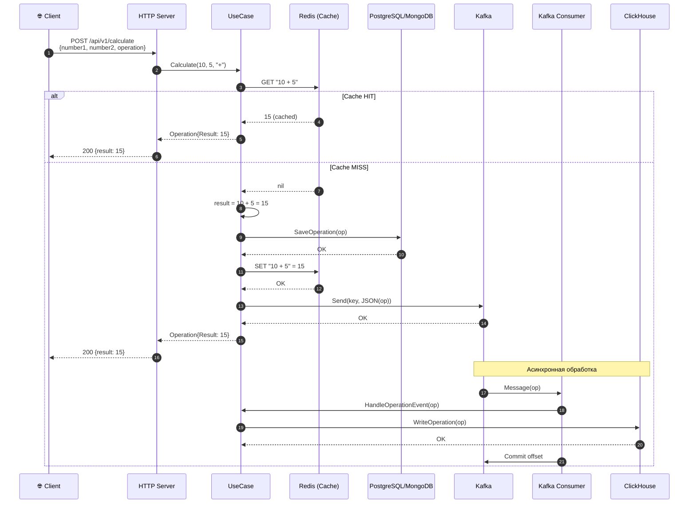

# LizzyCalc — Архитектура системы

## Общая схема компонентов

```
┌─────────────────────────────────────────────────────────────────────────────────────────┐
│                                      КЛИЕНТЫ                                            │
├─────────────────────────────────────────────────────────────────────────────────────────┤
│                                                                                         │
│   ┌──────────────┐     ┌──────────────┐     ┌──────────────┐     ┌──────────────┐      │
│   │   Browser    │     │   Postman    │     │  Swagger UI  │     │  gRPC Client │      │
│   │  (Frontend)  │     │    / cURL    │     │  :8080/swag  │     │   (любой)    │      │
│   └──────┬───────┘     └──────┬───────┘     └──────┬───────┘     └──────┬───────┘      │
│          │                    │                    │                    │              │
│          │ HTTP               │ HTTP               │ HTTP               │ gRPC         │
│          │ :8080              │ :8080              │ :8080              │ :9090         │
└──────────┼────────────────────┼────────────────────┼────────────────────┼──────────────┘
           │                    │                    │                    │
           ▼                    ▼                    ▼                    ▼
┌─────────────────────────────────────────────────────────────────────────────────────────┐
│                              CALCULATOR SERVICE                                         │
│                                   (Go app)                                              │
├─────────────────────────────────────────────────────────────────────────────────────────┤
│                                                                                         │
│  ┌─────────────────────────────────────────────────────────────────────────────────┐   │
│  │                              API Layer                                           │   │
│  ├─────────────────────────────────┬───────────────────────────────────────────────┤   │
│  │         HTTP Server (:8080)     │            gRPC Server (:9090)                │   │
│  │  ┌───────────────────────────┐  │  ┌─────────────────────────────────────────┐  │   │
│  │  │ POST /api/v1/calculate    │  │  │ CalculatorService.Calculate()           │  │   │
│  │  │ GET  /api/v1/history      │  │  │ CalculatorService.History()             │  │   │
│  │  │ GET  /liveness            │  │  └─────────────────────────────────────────┘  │   │
│  │  │ GET  /readyness           │  │                                               │   │
│  │  │ GET  /swagger/*           │  │                                               │   │
│  │  └───────────────────────────┘  │                                               │   │
│  └─────────────────────────────────┴───────────────────────────────────────────────┘   │
│                                         │                                               │
│                                         ▼                                               │
│  ┌─────────────────────────────────────────────────────────────────────────────────┐   │
│  │                              UseCase Layer                                       │   │
│  │                         (internal/usecase/calculator)                            │   │
│  ├─────────────────────────────────────────────────────────────────────────────────┤   │
│  │                                                                                  │   │
│  │   Calculate(number1, number2, operation) → result                               │   │
│  │   ├─ 1. Проверить кэш (Redis)                                                   │   │
│  │   │     └─ HIT → вернуть результат из кэша                                      │   │
│  │   ├─ 2. MISS → вычислить результат                                              │   │
│  │   ├─ 3. Сохранить в БД (Postgres/Mongo)                                         │   │
│  │   ├─ 4. Сохранить в кэш (Redis)                                                 │   │
│  │   └─ 5. Отправить событие в Kafka                                               │   │
│  │                                                                                  │   │
│  │   History() → []Operation                                                        │   │
│  │   └─ Получить из БД (Postgres/Mongo)                                            │   │
│  │                                                                                  │   │
│  │   HandleOperationEvent(op) — вызывается Kafka Consumer                          │   │
│  │   └─ Записать в ClickHouse (аналитика)                                          │   │
│  │                                                                                  │   │
│  └─────────────────────────────────────────────────────────────────────────────────┘   │
│                    │              │              │              │                       │
│                    ▼              ▼              ▼              ▼                       │
│  ┌─────────────────────────────────────────────────────────────────────────────────┐   │
│  │                           Infrastructure Layer                                   │   │
│  │                          (internal/infrastructure/*)                             │   │
│  ├────────────────┬────────────────┬────────────────┬────────────────┬─────────────┤   │
│  │   pg/ или      │    redis/      │    kafka/      │    kafka/      │   click/    │   │
│  │   mongo/       │                │   producer     │   consumer     │             │   │
│  │  Repository    │     Cache      │                │                │  Analytics  │   │
│  └───────┬────────┴───────┬────────┴───────┬────────┴───────┬────────┴──────┬──────┘   │
│          │                │                │                │               │          │
└──────────┼────────────────┼────────────────┼────────────────┼───────────────┼──────────┘
           │                │                │                │               │
           ▼                ▼                ▼                ▼               ▼
┌─────────────────────────────────────────────────────────────────────────────────────────┐
│                                 INFRASTRUCTURE                                          │
├─────────────────────────────────────────────────────────────────────────────────────────┤
│                                                                                         │
│  ┌──────────────┐  ┌──────────────┐  ┌──────────────┐  ┌──────────────┐                │
│  │  PostgreSQL  │  │    Redis     │  │    Kafka     │  │  ClickHouse  │                │
│  │    :5432     │  │    :6379     │  │    :9092     │  │    :9000     │                │
│  │              │  │              │  │              │  │    :8123     │                │
│  │  operations  │  │  key:result  │  │  operations  │  │  operations_ │                │
│  │    table     │  │    cache     │  │    topic     │  │   analytics  │                │
│  └──────────────┘  └──────────────┘  └──────────────┘  └──────────────┘                │
│         │                                   │                                           │
│         │          ┌──────────────┐         │          ┌──────────────┐                │
│         └─ OR ─────│   MongoDB    │         └──────────│  Zookeeper   │                │
│                    │   :27017     │                    │    :2181     │                │
│                    │  operations  │                    │  (для Kafka) │                │
│                    │  collection  │                    └──────────────┘                │
│                    └──────────────┘                                                     │
│                                                                                         │
└─────────────────────────────────────────────────────────────────────────────────────────┘
```

---

## Поток данных: POST /api/v1/calculate



---

## Поток данных: текстовая схема

```
┌─────────────────────────────────────────────────────────────────────────────┐
│                    POST /api/v1/calculate                                   │
│                    {number1: 10, number2: 5, operation: "+"}                │
└─────────────────────────────────────────────────────────────────────────────┘
                                    │
                                    ▼
┌─────────────────────────────────────────────────────────────────────────────┐
│ [1] HTTP Controller                                                         │
│     • Парсит JSON → CalculateRequest                                        │
│     • Валидирует (operation ∈ {+, -, *, /})                                 │
│     • Вызывает UseCase.Calculate()                                          │
└─────────────────────────────────────────────────────────────────────────────┘
                                    │
                                    ▼
┌─────────────────────────────────────────────────────────────────────────────┐
│ [2] UseCase.Calculate()                                                     │
│     key = "10 + 5"                                                          │
└─────────────────────────────────────────────────────────────────────────────┘
                                    │
                    ┌───────────────┴───────────────┐
                    ▼                               │
┌───────────────────────────────────┐               │
│ [3] Redis: GET "10 + 5"           │               │
└───────────────────────────────────┘               │
          │                                         │
          ├─── HIT: return cached ──────────────────┼──► Response {result: 15}
          │                                         │
          ▼ MISS                                    │
┌───────────────────────────────────┐               │
│ [4] Вычисление: 10 + 5 = 15       │               │
└───────────────────────────────────┘               │
                    │                               │
                    ▼                               │
┌───────────────────────────────────┐               │
│ [5] PostgreSQL/MongoDB            │               │
│     INSERT INTO operations        │               │
│     (number1, number2, op, result)│               │
└───────────────────────────────────┘               │
                    │                               │
                    ▼                               │
┌───────────────────────────────────┐               │
│ [6] Redis: SET "10 + 5" = 15      │               │
│     (TTL по умолчанию)            │               │
└───────────────────────────────────┘               │
                    │                               │
                    ▼                               │
┌───────────────────────────────────┐               │
│ [7] Kafka Producer                │               │
│     topic: "operations"           │               │
│     key: "10 + 5"                 │               │
│     value: JSON(Operation)        │               │
└───────────────────────────────────┘               │
                    │                               │
                    ├───────────────────────────────┘
                    │
                    ▼
          Response {result: 15}

═══════════════════════════════════════════════════════════════════════════════
                         АСИНХРОННАЯ ЧАСТЬ (Kafka → ClickHouse)
═══════════════════════════════════════════════════════════════════════════════

┌───────────────────────────────────┐
│ [8] Kafka Consumer (goroutine)    │
│     • consumer group: lizzycalc   │
│     • topic: operations           │
│     • FetchMessage() в цикле      │
└───────────────────────────────────┘
                    │
                    ▼
┌───────────────────────────────────┐
│ [9] json.Unmarshal → Operation    │
└───────────────────────────────────┘
                    │
                    ▼
┌───────────────────────────────────┐
│ [10] UseCase.HandleOperationEvent │
└───────────────────────────────────┘
                    │
                    ▼
┌───────────────────────────────────┐
│ [11] ClickHouse                   │
│      INSERT INTO operations_      │
│      analytics (...)              │
│      • Для аналитических запросов │
│      • GROUP BY operation         │
│      • Агрегация по времени       │
└───────────────────────────────────┘
                    │
                    ▼
┌───────────────────────────────────┐
│ [12] Kafka: CommitMessage()       │
│      offset зафиксирован          │
└───────────────────────────────────┘
```

---

## Компоненты системы

### Основное хранилище (PostgreSQL или MongoDB)

```
┌─────────────────────────────────────────────────────────────┐
│                    Feature Flag                             │
│           CALCULATOR_FEATURE_FLAGS_USE_PG_STORAGE           │
├────────────────────────────┬────────────────────────────────┤
│         true (default)     │            false               │
├────────────────────────────┼────────────────────────────────┤
│                            │                                │
│  ┌──────────────────────┐  │  ┌──────────────────────────┐  │
│  │     PostgreSQL       │  │  │       MongoDB            │  │
│  │     :5432            │  │  │       :27017             │  │
│  ├──────────────────────┤  │  ├──────────────────────────┤  │
│  │ TABLE operations     │  │  │ DB: lizzycalc            │  │
│  │ ├─ id SERIAL PK      │  │  │ Collection: operations   │  │
│  │ ├─ number1 FLOAT8    │  │  │ ├─ _id: ObjectId         │  │
│  │ ├─ number2 FLOAT8    │  │  │ ├─ number1: Double       │  │
│  │ ├─ operation VARCHAR │  │  │ ├─ number2: Double       │  │
│  │ ├─ result FLOAT8     │  │  │ ├─ operation: String     │  │
│  │ ├─ message TEXT      │  │  │ ├─ result: Double        │  │
│  │ └─ created_at TS     │  │  │ ├─ message: String       │  │
│  └──────────────────────┘  │  │ └─ created_at: Date      │  │
│                            │  └──────────────────────────┘  │
└────────────────────────────┴────────────────────────────────┘
```

### Кэш (Redis)

```
┌─────────────────────────────────────────────────────────────┐
│                         Redis                               │
│                         :6379                               │
├─────────────────────────────────────────────────────────────┤
│                                                             │
│   KEY                          VALUE         TTL            │
│   ─────────────────────────────────────────────────         │
│   "10 + 5"                     "15"          default        │
│   "100 * 2"                    "200"         default        │
│   "50 / 2"                     "25"          default        │
│                                                             │
│   Формат ключа: "{number1} {operation} {number2}"           │
│                                                             │
└─────────────────────────────────────────────────────────────┘
```

### Kafka

```
┌─────────────────────────────────────────────────────────────┐
│                         Kafka                               │
│                      :9092 (host)                           │
│                      :29092 (internal)                      │
├─────────────────────────────────────────────────────────────┤
│                                                             │
│   Topic: operations                                         │
│   Partitions: 3                                             │
│   Replication: 1                                            │
│                                                             │
│   ┌─────────────────────────────────────────────────────┐   │
│   │ Partition 0    Partition 1    Partition 2           │   │
│   │ ┌─────────┐    ┌─────────┐    ┌─────────┐          │   │
│   │ │ msg 0   │    │ msg 0   │    │ msg 0   │          │   │
│   │ │ msg 1   │    │ msg 1   │    │ msg 1   │          │   │
│   │ │ msg 2   │    │ ...     │    │ ...     │          │   │
│   │ │ ...     │    │         │    │         │          │   │
│   │ └─────────┘    └─────────┘    └─────────┘          │   │
│   └─────────────────────────────────────────────────────┘   │
│                                                             │
│   Consumer Group: lizzycalc-app                             │
│   └─ 1 consumer (calculator service)                        │
│                                                             │
│   Message format:                                           │
│   ├─ Key:   "10 + 5" (bytes)                               │
│   └─ Value: {"Number1":10,"Number2":5,"Operation":"+",...}  │
│                                                             │
└─────────────────────────────────────────────────────────────┘
```

### ClickHouse (аналитика)

```
┌─────────────────────────────────────────────────────────────┐
│                       ClickHouse                            │
│                   :9000 (native)                            │
│                   :8123 (HTTP)                              │
├─────────────────────────────────────────────────────────────┤
│                                                             │
│   TABLE default.operations_analytics                        │
│   ENGINE = MergeTree()                                      │
│   ORDER BY (created_at, operation)                          │
│   PARTITION BY toYYYYMM(created_at)                         │
│                                                             │
│   ┌─────────────────────────────────────────────────────┐   │
│   │ number1     Float64                                 │   │
│   │ number2     Float64                                 │   │
│   │ operation   String                                  │   │
│   │ result      Float64                                 │   │
│   │ message     String                                  │   │
│   │ created_at  DateTime64(3)                           │   │
│   └─────────────────────────────────────────────────────┘   │
│                                                             │
│   Примеры аналитических запросов:                           │
│                                                             │
│   -- Количество операций по типам                           │
│   SELECT operation, count() FROM operations_analytics       │
│   GROUP BY operation                                        │
│                                                             │
│   -- Операций за последний час                              │
│   SELECT count() FROM operations_analytics                  │
│   WHERE created_at > now() - INTERVAL 1 HOUR                │
│                                                             │
└─────────────────────────────────────────────────────────────┘
```

---

## Порты и UI-инструменты

```
┌─────────────────────────────────────────────────────────────────────────────┐
│                              ПОРТЫ СИСТЕМЫ                                  │
├─────────────────────────────────────────────────────────────────────────────┤
│                                                                             │
│   ПРИЛОЖЕНИЕ                                                                │
│   ├─ :8080   HTTP API + Swagger UI                                          │
│   │          http://localhost:8080/swagger/index.html                       │
│   └─ :9090   gRPC API                                                       │
│                                                                             │
│   БАЗЫ ДАННЫХ                                                               │
│   ├─ :5433   PostgreSQL (5432 внутри контейнера)                            │
│   ├─ :27017  MongoDB                                                        │
│   ├─ :6379   Redis                                                          │
│   ├─ :9000   ClickHouse (native protocol)                                   │
│   └─ :8123   ClickHouse (HTTP)                                              │
│                                                                             │
│   KAFKA                                                                     │
│   ├─ :9092   Kafka (host)                                                   │
│   ├─ :29092  Kafka (внутренний, для контейнеров)                            │
│   └─ :2181   Zookeeper                                                      │
│                                                                             │
│   UI-ИНСТРУМЕНТЫ                                                            │
│   ├─ :8082   Mongo Express    http://localhost:8082                         │
│   ├─ :5540   RedisInsight     http://localhost:5540                         │
│   ├─ :8090   Kafka UI         http://localhost:8090                         │
│   └─ :8081   ClickHouse UI    http://localhost:8081                         │
│                                                                             │
└─────────────────────────────────────────────────────────────────────────────┘
```

---

## Clean Architecture

```
┌─────────────────────────────────────────────────────────────────────────────┐
│                                                                             │
│                           cmd/calculator/main.go                            │
│                                   │                                         │
│                                   ▼                                         │
│   ┌─────────────────────────────────────────────────────────────────────┐   │
│   │                         internal/app/                               │   │
│   │                                                                     │   │
│   │   • Загрузка конфига (envconfig)                                    │   │
│   │   • Инициализация всех зависимостей                                 │   │
│   │   • Wiring (связывание слоёв)                                       │   │
│   │   • Graceful shutdown                                               │   │
│   └─────────────────────────────────────────────────────────────────────┘   │
│                                   │                                         │
│           ┌───────────────────────┼───────────────────────┐                 │
│           ▼                       ▼                       ▼                 │
│   ┌───────────────┐       ┌───────────────┐       ┌───────────────┐         │
│   │  internal/    │       │  internal/    │       │  internal/    │         │
│   │  api/http/    │       │  api/grpc/    │       │  usecase/     │         │
│   │               │       │               │       │  calculator/  │         │
│   │  Controllers  │       │  gRPC Server  │       │               │         │
│   │  Middlewares  │       │  Interceptors │       │  Бизнес-      │         │
│   │  Server       │       │               │       │  логика       │         │
│   └───────┬───────┘       └───────┬───────┘       └───────┬───────┘         │
│           │                       │                       │                 │
│           └───────────────────────┼───────────────────────┘                 │
│                                   │                                         │
│                                   ▼                                         │
│   ┌─────────────────────────────────────────────────────────────────────┐   │
│   │                        internal/ports/                              │   │
│   │                                                                     │   │
│   │   Интерфейсы (контракты между слоями):                              │   │
│   │   • IOperationRepository  — работа с БД                             │   │
│   │   • ICache                — кэширование                             │   │
│   │   • IBroker               — отправка в Kafka                        │   │
│   │   • IOperationAnalytics   — запись в ClickHouse                     │   │
│   │   • ICalculatorUseCase    — бизнес-логика                           │   │
│   └─────────────────────────────────────────────────────────────────────┘   │
│                                   │                                         │
│                                   ▼                                         │
│   ┌─────────────────────────────────────────────────────────────────────┐   │
│   │                    internal/infrastructure/                         │   │
│   │                                                                     │   │
│   │   Реализации интерфейсов:                                           │   │
│   │   ├─ pg/       → IOperationRepository (PostgreSQL)                  │   │
│   │   ├─ mongo/    → IOperationRepository (MongoDB)                     │   │
│   │   ├─ redis/    → ICache                                             │   │
│   │   ├─ kafka/    → IBroker (producer) + Consumer                      │   │
│   │   └─ click/    → IOperationAnalytics                                │   │
│   └─────────────────────────────────────────────────────────────────────┘   │
│                                   │                                         │
│                                   ▼                                         │
│   ┌─────────────────────────────────────────────────────────────────────┐   │
│   │                        internal/domain/                             │   │
│   │                                                                     │   │
│   │   • Operation struct                                                │   │
│   │   • Константы операций (OpAdd, OpSub, OpMul, OpDiv)                 │   │
│   │   • Доменные ошибки (ErrUnknownOperation)                           │   │
│   └─────────────────────────────────────────────────────────────────────┘   │
│                                                                             │
└─────────────────────────────────────────────────────────────────────────────┘
```

---

## Docker Compose: зависимости сервисов

```
                                    calculator
                                        │
                    ┌───────────────────┼───────────────────┐
                    │                   │                   │
                    ▼                   ▼                   ▼
               ┌────────┐         ┌──────────┐        ┌──────────┐
               │postgres│         │  redis   │        │  kafka   │
               │healthy │         │ healthy  │        │ healthy  │
               └────────┘         └──────────┘        └────┬─────┘
                                                          │
               ┌────────┐                            ┌────▼─────┐
               │mongodb │                            │zookeeper │
               │healthy │                            │ healthy  │
               └────────┘                            └──────────┘

               ┌────────┐
               │clickhou│
               │healthy │
               └────────┘


    UI-инструменты (опционально):

    mongo-express ──► mongodb
    redisinsight  ──► redis
    kafka-ui      ──► kafka + zookeeper
    clickhouse-ui ──► clickhouse
```

---

## Быстрый старт

```bash
# Поднять всё
make backend-from-zero

# Проверить
curl http://localhost:8080/liveness
curl http://localhost:8080/api/v1/calculate \
  -H "Content-Type: application/json" \
  -d '{"number1": 10, "number2": 5, "operation": "+"}'

# Swagger UI
open http://localhost:8080/swagger/index.html

# UI-инструменты
open http://localhost:8082   # Mongo Express
open http://localhost:5540   # RedisInsight
open http://localhost:8090   # Kafka UI
open http://localhost:8081   # ClickHouse UI
```
